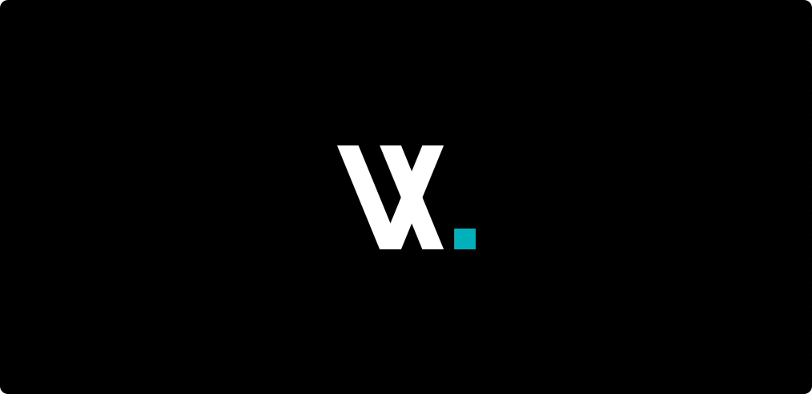
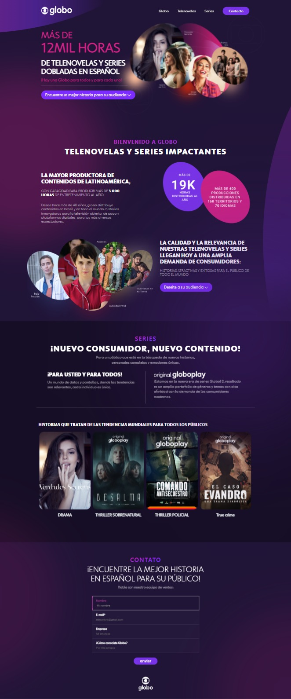

# Teste desenvolvedor front-end

## Já sou um VXzeiro!

Estou na VX desde setembro de 2021 (<a href="https://www.linkedin.com/in/ssjuan/" target="_blank">clique aqui</a> para me conhecer melhor).

Gosto de desafios e resolver problemas 🤓.

Tenho disponibilidade para trabalhar em horários flexíveis, gosto da modalidade home office, amei o café da VX 😍 e gosto da equipe em que trabalho.

## Meu objetivo

Resolvi fazer o teste como treino para crecimento pessoal, para mostrar como tenho evoluido e tentar um **upgrade** na minha carreira com DEV com novos desafios.

## O que usei no teste

- [x] Front-end responsivo entre 500px a 1080px.
- [x] Carrossel (em JS).
- [x] Versionamento (Github).
- [x] Utilizei para o Task Runner (Gulp para concatenar o scss).
- [x] Pré Processador (Sass).
- [x] Padrão de organização de CSS (BEM).

## Minha LP 

## Obrigado pela oportunidade

